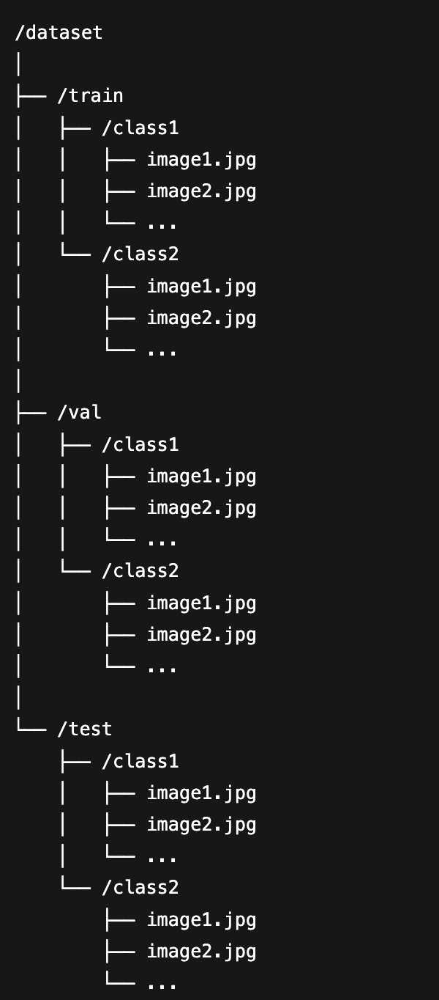
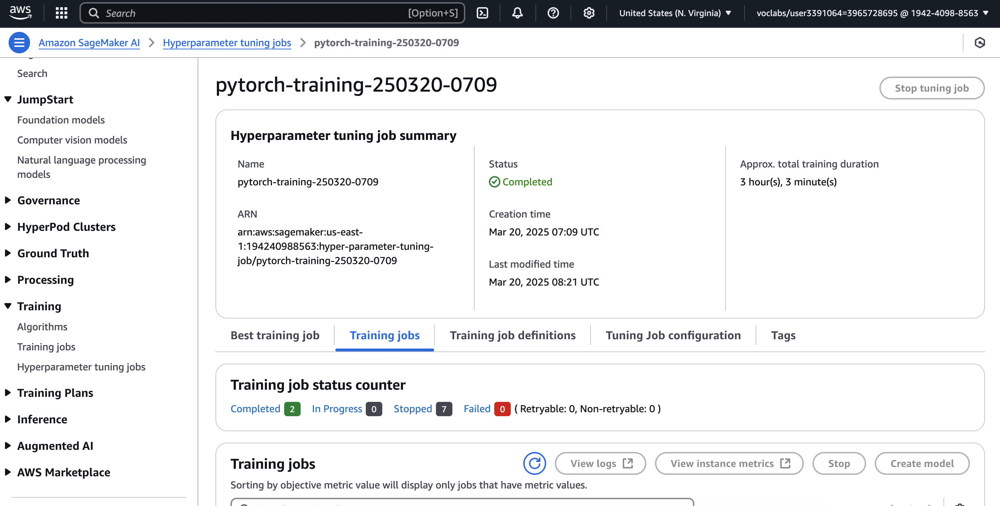
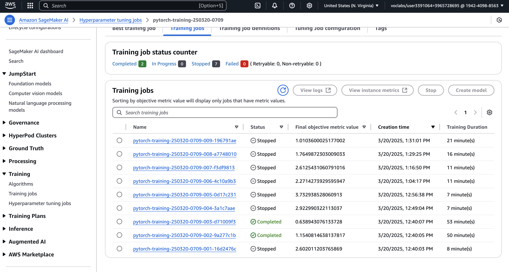
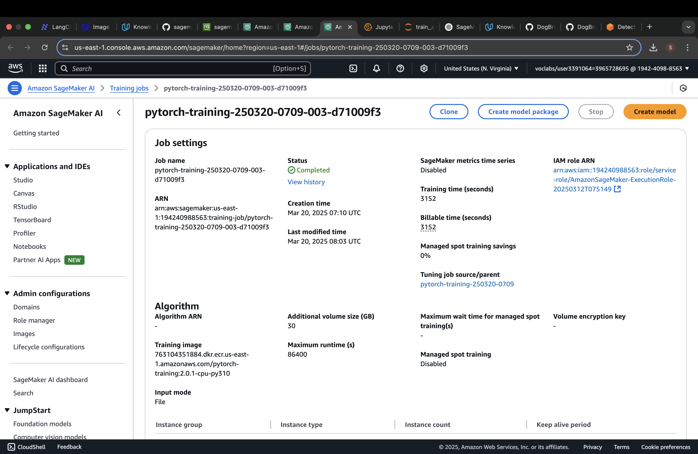
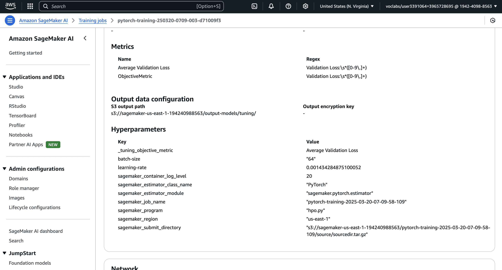
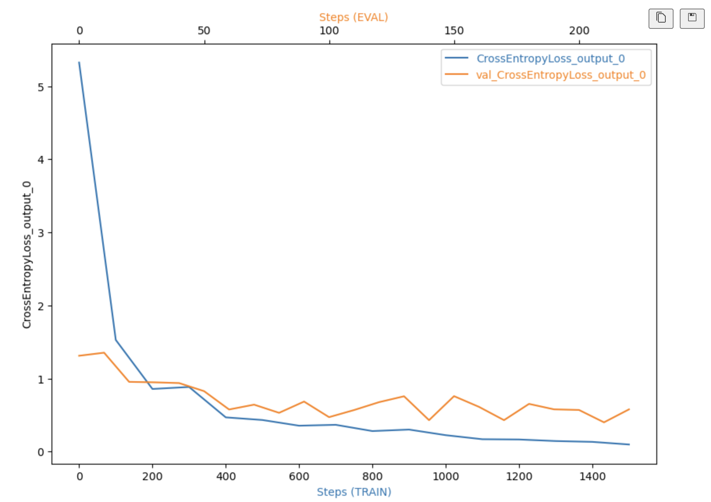
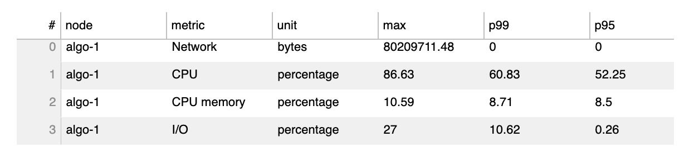
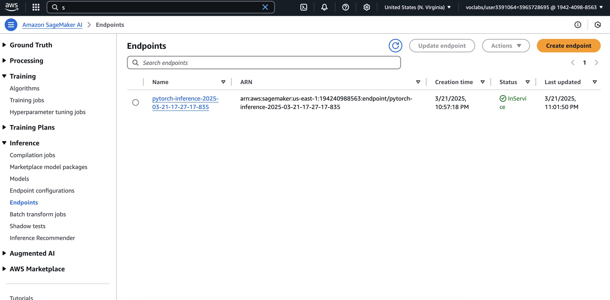
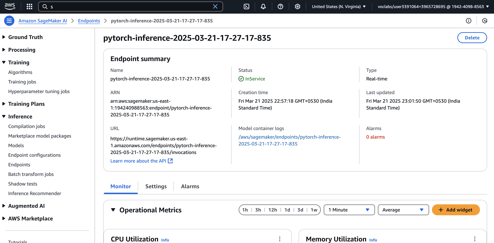
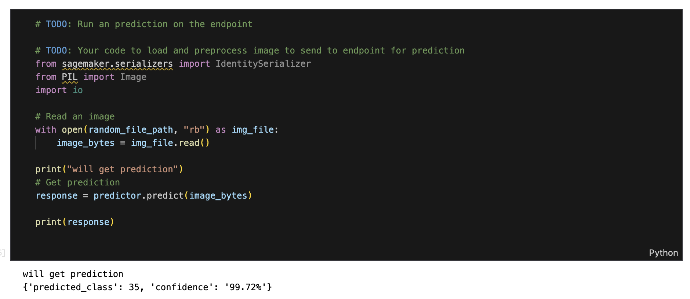

# Image Classification Using AWS SageMaker

In this project, we implement the Machine Learning Engineering Flow (using PyTorch on AWS SageMaker) of using transfer learning on a pre-trained image classification model, performing Hyperparameter tuning, training, deploying the model on SageMaker and using the endpoint for predictions.  

The code makes use of Sagemaker Debugger and Sagemaker Profiler to get insights into the training process and take actions to rectify any issues, if needed.

## Project Set Up and Installation

The project consists of the following files:
1. train_and_deploy.ipynb -> This notebook contains the code for loading the data, creating various models/estimators be using the appropriate entry point, hyperparameter tuning, identifying the best hyperparameters, training, evalating debug and profiler outputs and inference.
2. hpo.py -> This notebook is to be used as the entry point for hypertuning job  
3. train_model.py -> This notebook is to be used as the entry point for training job  
4. inference.py -> This notebook is to be used as the entry point for inference endpoint  
5. requirements.txt -> This file contains the requirements that need to be installed in the deployement container for inference. Since in the training, the whole model is being stored (instead of only state), smdebug is needed to be installed in the deployment container. This dependency can be removed by storing only the state of the model and making the appropriate changes in inference.py, if needed.  

The files inference.py and requirements.txt are in a separate folder and the source_folder path has been given while creating the model object for deployment. This will ensure that the needed files (smdebug in this case) are installed in the container.

The files can be uploaded to Juypter Space in SageMaker Studio. The train_and_deploy.ipynb needs to be used to execute. Different jobs will be created and run in containers based on the parameters given while creating the estimators/models. The model is trained using a CPU, but a GPU instance can be used as well by updating the instance_type at the needed places. Approriate permissions will need to be set up for AWS.

## Dataset

### Overview
Dog Breed Classification dataset has been used to fine-tune the model. This dataset has data for 133 breeds of dogs and is pre-split between training, validation and test dataset. The dataset is organized in the following hierarchy.

### Access
The data was downloaded from this link, unzipped and uploaded to S3 in AWS.  

The code for the same is:

!wget --no-check-certificate --quiet https://s3-us-west-1.amazonaws.com/udacity-aind/dog-project/dogImages.zip  
!unzip -q dogImages.zip  
!aws s3 sync dogImages/train/ s3://${DEFAULT_S3_BUCKET}/dogImages/train/ --quiet  
!aws s3 sync dogImages/test/ s3://${DEFAULT_S3_BUCKET}/dogImages/test/ --quiet  
!aws s3 sync dogImages/valid/ s3://${DEFAULT_S3_BUCKET}/dogImages/valid/ --quiet  

## Hyperparameter Tuning
ResNet18 was used for this project. The reason it was selected was because it is lightweight and hence can be fine-tuned on CPU pretty fast. Also, it has been trained on ImageNet data, which means that it can be easily fine-tuned for image classification tasks for data sets like dog breed classification.

The hyperparameter tuning was done for two parameter - learning rate and batch size. 

Follwing space was used:

learning rate --> ContinuousParameter(0.001, 0.1)  
batch size --> CategoricalParameter([32, 64, 128, 256])  

The tuning was done for 9 times with 3 instances running in parallel. 

Object Metric Value Used --> Minimize Average Validation Loss.

The screenshots of hypertuning job is below, with the final object metric value.

The following screenshots show run of one of the training jobs during the hyperparameter tuning. It also show the objective metric used and the final value of hyper parameters

The following best hyperparameters were selected from the job and used for training the model.

learning rate = 0.001434284875100052  
batch-size = 64

## Training

The model was trained using the best hyper parameters selected during the hyper parameter tuning. 
Sagemaker Debugger and Profiling configurations were enabled during the training.

## Debugging and Profiling
The debugging and profiling was done by adding the corresponding configurations. Rules to test for vanishing gradient, over fitting, over training and poor weight initializations were added. CrossEntropyLoss_output_0 tensor is saved. 
For profiler, system monitoring is done at the interval of 500 ms.

### Results
**TODO**: What are the results/insights did you get by profiling/debugging your model?

### Debugger Result Analysis
The plot of loss vs steps shows that both validation loss and training loss are reducing. While the training loss loss curve is smoother, the validation loss curve is not so. in fact, after 60 steps, the validation loss is oscillating around the same value.

Overfitting could be a reason for this. Adding regularization could be of help. 

Another possibility could be to use a better model like ResNet50, which can generalize better.

### Profiler Result Analysis
The profiler showed that the max memory hit was 10.59%. this means that the training could have been done on an instance with lower memory. Max CPU was 86.63%, so the compute power of the instance needed was fine. The reason for this could be that the model used (ResNet18) is a light weight model, and hence does not need very high amount of memory.

## Model Deployment

The model is deployed using inference.py as the entry point. Since the saved model has smdebug dependency (as I saved the whole model, during training), smdebug has to be installed in the deployment container. This is done by putting the files inference.py and requirements.txt in a folder and giving that as the source folder.

The following screenshots shows an active endpoint deployed.

The endpoint can be queried using the predict method and passing the image in bytes.  

Following screenshot shows a sample of the query and response.

## Standout Suggestions
**TODO (Optional):** This is where you can provide information about any standout suggestions that you have attempted.
